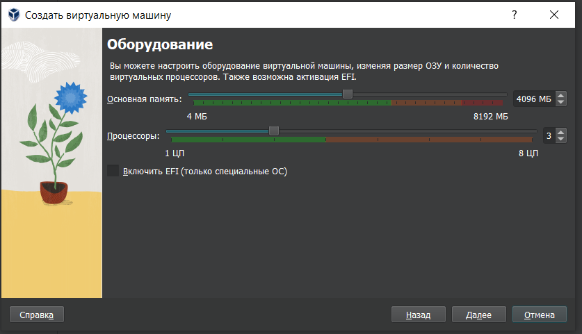
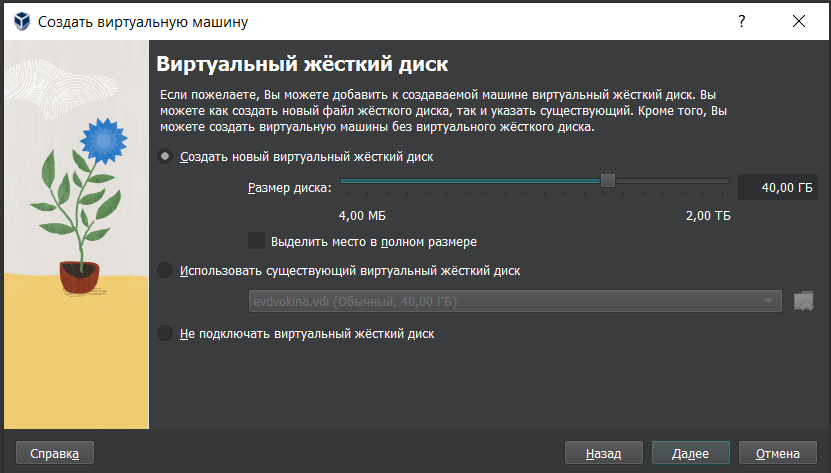
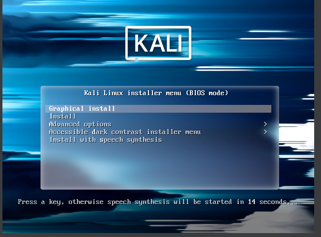
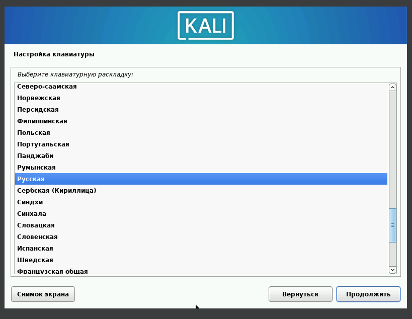
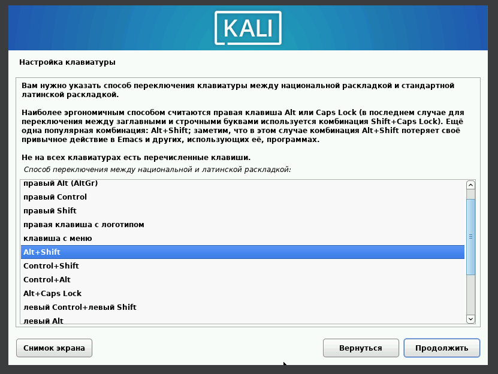
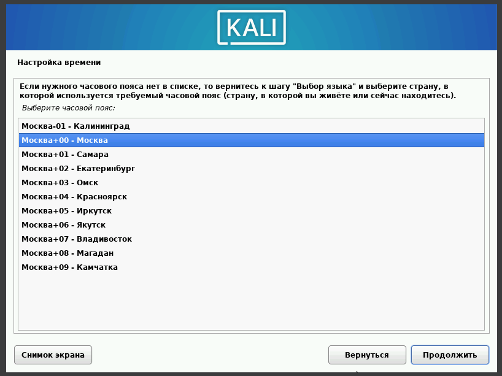
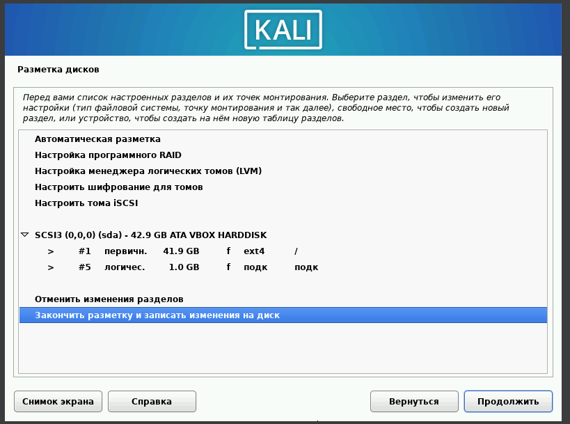
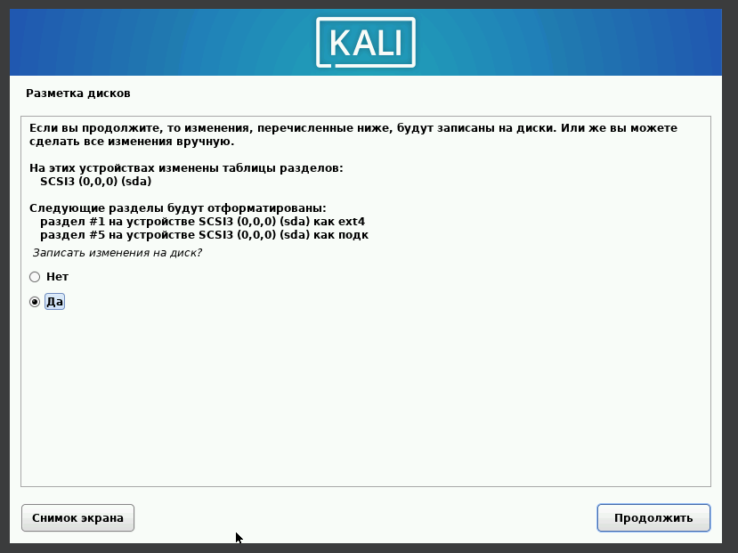
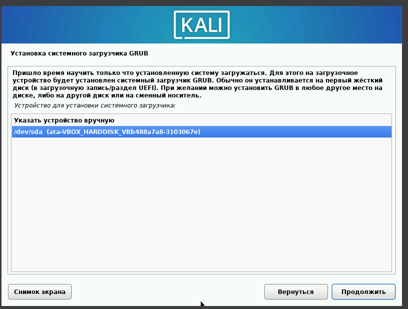
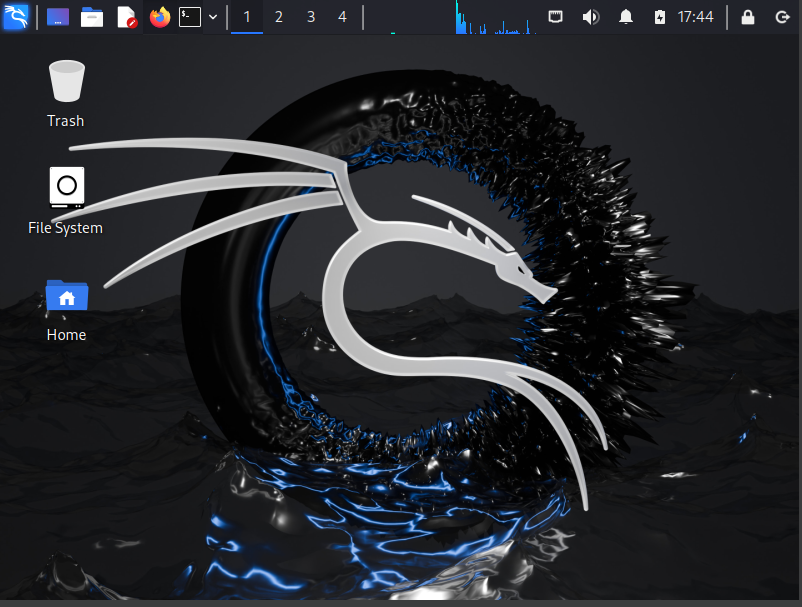

---
## Author
author:
  name: Бондарь Татьяна Владимировна
  degrees: 
  orcid: 0000-0002-0877-7063
  email: 1132246711@rudn.ru
  affiliation:
    - name: Российский университет дружбы народов
      country: Российская Федерация
      postal-code: 117198
      city: Москва
      address: ул. Миклухо-Маклая, д. 6
## Title
title: Иедивидуальный проект
subtitle: Этап 1
license: CC BY
date: today
date-format: "YYYY-MM-DD" # Example: 2025-09-06
---

# Информация

## Докладчик

:::::::::::::: {.columns align=center}
::: {.column width="70%"}

  * Бондарь Татьяна Владимировна
  * НКАбд-01-24
  * Российский университет дружбы народов им. П. Лумумбы
  * [1132246711@rudn.ru](mailto:1132246711@rudn.ru)

:::
::: {.column width="30%"}

:::
::::::::::::::

# Цель работы

Приобретение практических навыков по установке операционной системы Linux на виртуальную машину.

# Задание

1. Установить дистрибутив Kali Linux на виртуальную машину VirtualBox.

# Теоретическое введение

Kali Linux — это дистрибутив Linux на основе Debian с открытым исходным кодом, предназначенный для расширенного тестирования на проникновение, проверки уязвимостей, аудита безопасности систем и сетей.

**Сферы применения дистрибутива**:

- Тестирование на проникновение. Kali Linux широко используется в области тестирования безопасности, чтобы оценить уязвимости в компьютерных системах, сетях и приложениях. ОС предоставляет множество инструментов для обнаружения уязвимостей.

- Цифровое расследование. Дистрибутив предоставляет инструменты для сбора и анализа цифровых данных, включая восстановление удаленных файлов, извлечение метаданных, анализ системных журналов и т.д.

- Обратная разработка. Kali Linux содержит инструменты, которые помогают разработчикам анализировать готовое программное обеспечение, чтобы понять его работу, выявить уязвимости или разработать альтернативные реализации.

- Безопасность беспроводных сетей. У ОС есть набор инструментов для проверки и обеспечения безопасности беспроводных сетей. Kali Linux поддерживает анализ беспроводных протоколов, перехват и дешифрование сетевого трафика, а также атаки на беспроводные сети.

- Защита информации. Kali Linux также может использоваться для обеспечения безопасности информации, включая мониторинг сетевой активности, обнаружение вторжений, защиту от DDoS-атак и настройку брандмауэров.

# Выполнение лабораторной работы

Открываю VirtualBox, нажимаю `создать`, в появившемся окне выбираю тип операционной системы Linux, версия - Debian, задаю имя машины

Настраиваю основную память и количество выделяемых процессоров, необходимое для работы без помех (рис. 2).

{#fig:002 width=70%}

## 2

Настраиваю размер виртуального жесткого диска, выбираю 40ГБ (рис. 3).

{#fig:003 width=70%}

## 3

Соглашаюсь с получившимися характеристиками, жму `готово` 

Подключаю ранее скачанный образ диска 

В окне установки Kali выбираю графическую установку (рис. 6).

{#fig:006 width=70%}

## 4

Выбираю язык, на котором будет установка 

В местоположении выбираю Российскую Федерацию 

Выбираю раскладку клавиатуры (рис. 9).

{#fig:009 width=70%}

## 5

Выбираю комбинацию горячих клавиш для переключения раскладки клавиатуры (рис. 10).

{#fig:010 width=70%}

## 6

Ввожу имя компьютера 

Ввожу имя домена

Ввожу имя пользователя, у которой будут права суперпользователя 

Это же имя по умолчанию предлагается как имя моей учетной записи 

Ввожу пароль для созданного пользователя 

Выбираю часовой пояс (рис. 16).

{#fig:016 width=70%}

## 7

Теперь установщик проверяет диски и предлагает различные варианты,
в зависимости от настроек. Созданный виртуальный диск чистый, поэтому
я выбираю «весь диск» 

Убеждаюсь, что выбран нужный виртуальный диск, продолжаю
настройку разметки дисков 

Далее установщик предлагает выбрать схему разметки, ее я оставляю по
умолчанию «все файлы в одном разделе» 

После этого этапа надо подтвердить
окончание разметки дисков, чтобы изменения были записаны (рис. 20).

{#fig:020 width=70%}

## 8

Затем установщик дает еще раз просмотреть конфигурацию диска,
прежде чем внести необратимые изменения (рис. 21). После этого этапа
начнется установка.

{#fig:021 width=70%}

## 9

Далее я могу выбрать, какие метапакеты (пустые пакеты, которые
только описывают зависимости) я хотите установить. Выбор по
умолчанию установит стандартную систему Kali Linux, поэтому я не хочу
менять выбор 

Подтверждаю установку системного загрузчика GRUB (Загрузчик
операционной системы от проекта GNU программа для управления
процессом загрузки), также выбираю виртуальный диск, на который
устанавливать GRUB  (рис. 23).

{#fig:023 width=70%}

## 10

Завершаю установку 

Проверяю, что в носителях теперь пусто 

Вхожу в систему от имени своего пользователя 

Вход в систему выполнен успешно, как и ее загрузка (рис. 27).

{#fig:027 width=70%}

# Выводы

Приобрела практические навыки по установке операционной системы Linux на виртуальную машину. Установила дистрибутив Kali LInux на VirtualBox.

# Список литературы. Библиография.

[1] [Официальная документация по устновке Kali Linux на VirtualBox](https://www.kali.org/docs/virtualization/install-virtualbox-guest-vm/)
